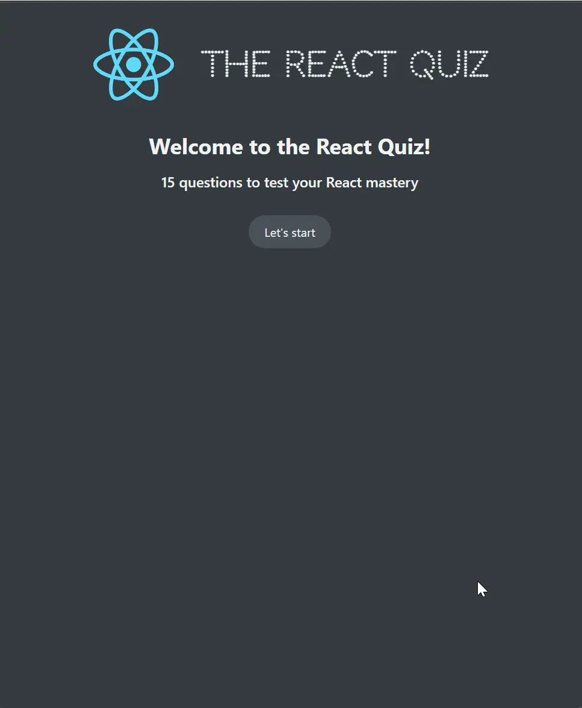

### 👋 **I am Erhan ERTEM**

&emsp;

## Udemy The Ultimate React Course 2023: React, Redux & More by Jonas Schmedtmann

### **Objective:** Create React-Quiz App

- Explore useReducer hook for centrelized interrelated state management

&emsp;

#### Link to Project &rarr; [React-Quiz App](https://app-reactquiz-erhan-ertem.netlify.app/)

---

 

Installed NPM packages and utilized APIs:

| Package command      | Package link | Description |
| -------------------- | ------------ | ----------- |
| npx create-react-app |              |             |
| json-server          |              |             |

&emsp;
